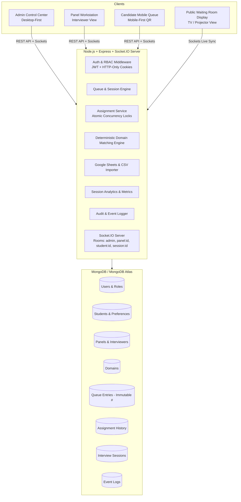

# PanelFlow — Real-Time Club Interview Management System

A production-grade, real-time web application engineered for high-traffic university club recruitments, hackathon team screenings, and multi-panel interview sessions. PanelFlow replaces manual paper-based queues with an authoritative real-time control center, immutable sequential queue ordering, human-in-the-loop domain matching, atomic race-condition concurrency protection, Google Sheets integration, and live WebSocket multi-screen synchronization.

---

## 1. Core Product Philosophy

> **This is NOT an automatic matchmaking system. The administrator is the final decision-maker.**

1. **Live Arrival Queue**: Students enter the queue in sequential order and receive an **immutable queue number** (e.g. `#1`, `#2`, `#3`) that never changes or gets renumbered.
2. **Human-in-the-Loop Matching**: Queue position defines arrival order, but the coordinator has full discretion to skip or triage candidates based on live panel domain availability (e.g. assigning `#3 Priya (ML)` to an available `P1 (ML)` panel while `#1 Ayush (AR/VR)` waits for `P2 (AR/VR)` to become free).
3. **Informational Match Scoring**: Deterministic matching indicators (`STRONG MATCH`, `GOOD MATCH`, `NO MATCH`) highlight compatibility with panel interviewers without forcing automated assignments.
4. **Authoritative Concurrency Protection**: Multi-admin race conditions are prevented at the database level using atomic conditional operations (`findOneAndUpdate` with `status: 'AVAILABLE'`). If two coordinators try to assign different students to the same panel simultaneously, exactly one succeeds and the other receives a descriptive `409 Conflict`.

---

## 2. System Architecture



---

## 3. Tech Stack

- **Frontend**: React 18, Vite, TypeScript, Tailwind CSS, Lucide Icons, TanStack Query, Zustand, Socket.IO Client, React Hook Form, Zod, Sonner, QRCode.react, Canvas-Confetti.
- **Backend**: Node.js, Express, TypeScript, Socket.IO, Mongoose, Zod, JWT, bcryptjs, CSV-Parse, Google APIs (Google Sheets API v4), Helmet, CORS, Express-Rate-Limit.
- **Database**: MongoDB / MongoDB Atlas (with automatic in-memory MongoDB fallback for instant zero-setup local dev and automated testing).

---

## 4. Key User Roles & Interfaces

| Role / Surface | Route | Capabilities |
|---|---|---|
| **Admin Control Center** | `/admin` | Live 2-pane split view (Waiting Queue & Panels Grid), Call Next candidate modal, 1-click domain match assignment, reassignment, cancellation, session control, Google Sheets import, QR code generation. |
| **Panel Workstation** | `/panel/:panelCode` | Panel status control (`AVAILABLE`, `OCCUPIED`, `PAUSED`, `OFFLINE`), live assigned candidate card with ordered domain preferences, running interview stopwatch timer, 1-click `[INTERVIEW COMPLETE]` action. |
| **Candidate Mobile QR** | `/interview/join`<br>`/interview/queue/:id` | Mobile-first QR entry, instant pre-imported registration number lookup, domain preference ranking, real-time ticket with live count ahead, pulsating assignment banner with panel room & interviewer info. |
| **Public Waiting TV Display** | `/display` | Split-screen kiosk for hall projectors showing **NOW CALLING** active interviews and **UP NEXT** waiting queue in real time. |

---

## 5. Folder Structure

```
PanelFlow/
├── server/
│   ├── src/
│   │   ├── config/          # Environment variables & MongoDB Atlas connection
│   │   ├── models/          # User, Student, Domain, Interviewer, Panel, QueueEntry, Assignment, Session, EventLog
│   │   ├── services/        # Queue, Assignment, Interview, Panel, Sheets, Analytics, Event services
│   │   ├── controllers/     # REST controllers
│   │   ├── routes/          # Express API route modules
│   │   ├── sockets/         # Socket.IO handlers and room management
│   │   ├── utils/           # JWT, Domain Matcher algorithm, ApiResponse
│   │   ├── validators/      # Zod request validation schemas
│   │   ├── seed/            # Development database seed script
│   │   ├── tests/           # Integration test suite (Vitest + Supertest)
│   │   ├── app.ts           # Express app setup
│   │   └── server.ts        # Server entry point
│   └── package.json
│
├── client/
│   ├── src/
│   │   ├── components/      # UI primitives, Admin, Panel, Student, and Display components
│   │   ├── pages/           # AdminDashboard, PanelsManagement, Analytics, AuditLogs, PanelDashboard, JoinQueue, QueueStatus, WaitingRoomDisplay, Login
│   │   ├── services/        # API client and backend service wrappers
│   │   ├── socket/          # Socket.IO client and room listeners
│   │   ├── store/           # Zustand stores for Auth, Socket, and Session
│   │   ├── utils/           # Formatters, class merging, domain match calculation
│   │   ├── App.tsx          # React Router setup
│   │   └── main.tsx         # Client entry point
│   └── package.json
│
├── .env.example
├── package.json
└── README.md
```

---

## 6. Getting Started Locally

### Prerequisites
- Node.js (v18+)
- npm (v9+)

### Installation
Clone the repository and install all dependencies:
```bash
git clone https://github.com/your-org/PanelFlow.git
cd PanelFlow
npm install
npm install --prefix server
npm install --prefix client
```

### Environment Variables
Copy `.env.example` to `.env`:
```bash
cp .env.example .env
```
*(Optional: Provide a `MONGODB_URI` from MongoDB Atlas. If omitted, PanelFlow automatically starts an in-memory MongoDB instance for instant zero-configuration development!)*

### Running the Application
Start both server and client concurrently:
```bash
npm run dev
```
- **Frontend App**: `http://localhost:5173`
- **Backend API & Sockets**: `http://localhost:5000`

---

## 7. Default Credentials & Demo Accounts

When started for the first time, PanelFlow automatically seeds the database with panels, interviewers, domains, and waiting candidates:

- **Admin Coordinator**:
  - Email: `admin@panelflow.com`
  - Password: `adminpassword123`
- **Panel Codes**:
  - `P1`: Panel 1 — Advanced Tech (Rahul: AR/VR, Ankit: IoT, Priya: ML)
  - `P2`: Panel 2 — Software & Security (Karan: Web, Aman: Android, Riya: Cybersecurity)
  - `P3`: Panel 3 — Engineering & Design (Dev: Backend, Neha: Frontend, Arjun: Game Dev)
  - `P4`: Panel 4 — Reserve Panel

---

## 8. Running Automated Tests

Run the test suite verifying sequential ordering, duplicate protection, atomic concurrency locking (409 Conflict), interview lifecycle completion, and RBAC authorization:
```bash
npm test
```

---

## 9. Google Sheets & CSV Bulk Import

PanelFlow supports importing Candidates, Interviewers, and Panels directly from CSV or Google Sheets:
1. Open the Admin Control Center at `/admin` and click **"Import Sheets"**.
2. Select your import type:
   - **Students & Preferences**: `Registration Number, Name, Email, Branch, Year, Preference 1, Preference 2, Preference 3`
   - **Interviewers & Domains**: `Panel, Name, Email, Domain 1, Domain 2`
   - **Panels**: `Panel Code, Name, Room Location`
3. Click **"Validate CSV"** to inspect a pre-commit verification preview showing valid rows and errors.
4. Click **"Commit Import"** to atomically ingest the records into MongoDB.

---

## 10. Deployment Guide

### Deploying Database (MongoDB Atlas)
1. Create a free cluster on [MongoDB Atlas](https://www.mongodb.com/atlas).
2. Create a database user and allow network access (`0.0.0.0/0` or your host IP).
3. Copy your connection string: `mongodb+srv://<user>:<password>@cluster.mongodb.net/panelflow?retryWrites=true&w=majority`.

### Deploying Backend (Render / Railway / Fly.io)
1. Set the root directory to `server` or configure build commands:
   - Build Command: `npm install && npm run build`
   - Start Command: `npm start`
2. Configure Environment Variables:
   - `NODE_ENV=production`
   - `PORT=5000`
   - `MONGODB_URI=<your-atlas-uri>`
   - `JWT_SECRET=<your-strong-random-secret>`
   - `CLIENT_URL=https://your-panelflow-frontend.vercel.app`

### Deploying Frontend (Vercel)
1. Connect your GitHub repository to [Vercel](https://vercel.com).
2. Set Root Directory to `client`.
3. Set Framework Preset to **Vite**.
4. Configure Build Command: `npm run build` and Output Directory: `dist`.
5. Set `VITE_API_URL` to your backend URL.
