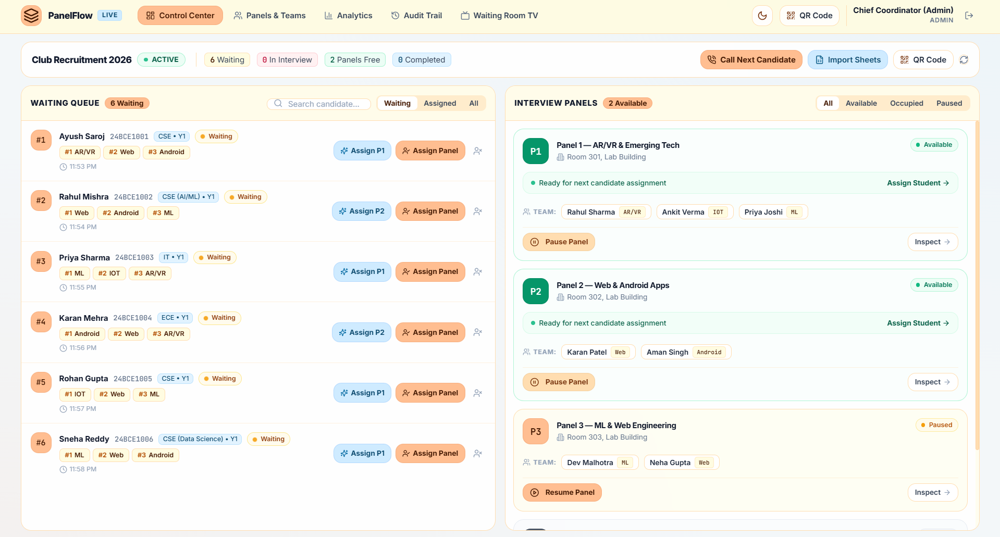
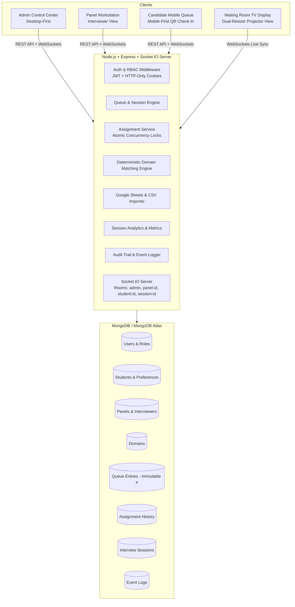
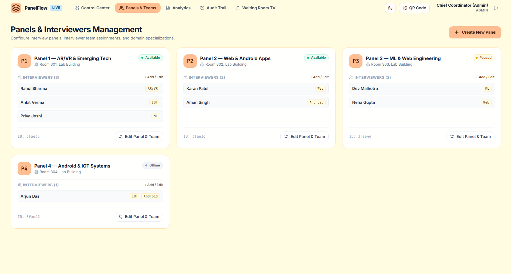
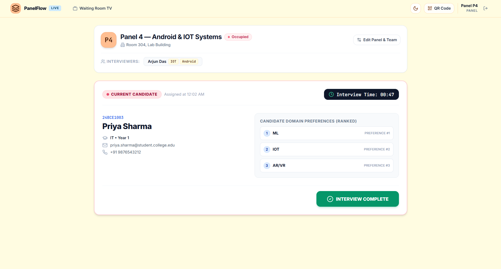
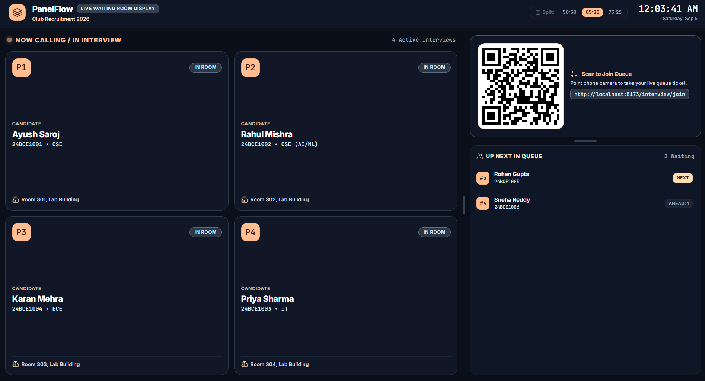
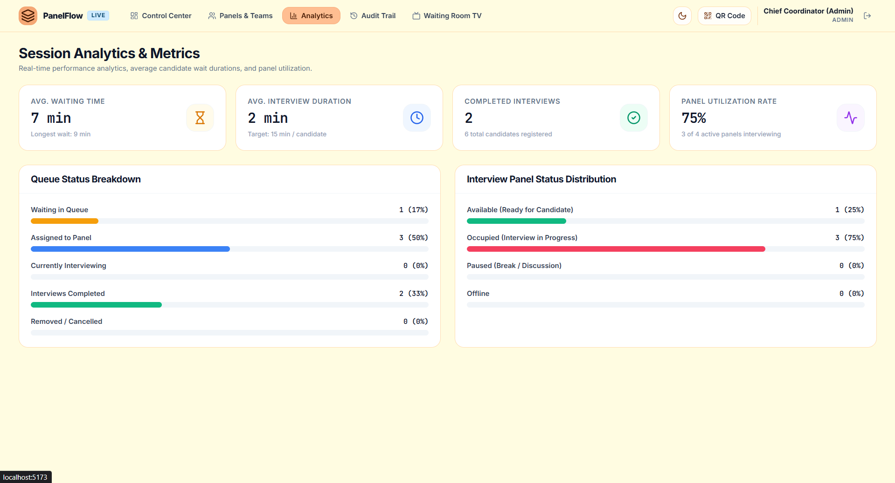

# PanelFlow — Real-Time Club Interview Management System

A production-grade, real-time web application engineered for high-traffic university club recruitments, hackathon team screenings, and multi-panel interview sessions. PanelFlow replaces manual paper-based queues with an authoritative real-time control center, immutable sequential queue ordering, human-in-the-loop domain matching, atomic race-condition concurrency protection, Google Sheets integration, interactive split-screen projector displays, and live WebSocket multi-screen synchronization.

<div align="center">
  
</div>

---

## 1. Core Product Philosophy

> **This is NOT an automated matchmaking black-box. The human administrator is the final decision-maker.**

1. **Immutable Live Arrival Queue**: Students enter the queue sequentially and receive a permanent **immutable ticket number** (e.g. `#1`, `#2`, `#3`) that never shifts or gets renumbered.
2. **Human-in-the-Loop Matching**: Arrival position establishes queue priority, while coordinators maintain complete discretion to triage or assign candidates based on live panel domain availability (e.g., assigning `#3 Priya (ML)` to an available `P1 (ML)` panel while `#1 Ayush (AR/VR)` waits for `P2 (AR/VR)` to finish).
3. **Deterministic Match Scoring**: High-visibility compatibility indicators (`STRONG MATCH`, `GOOD MATCH`, `NO MATCH`) compute overlap between candidate preferences and active panel interviewers without overriding human control.
4. **Authoritative Concurrency Protection**: Race conditions between multiple concurrent coordinators are prevented at the database level using atomic conditional operations (`findOneAndUpdate` with `status: 'AVAILABLE'`). If two admins attempt to assign different candidates to the same panel simultaneously, exactly one succeeds and the other receives a descriptive `409 Conflict`.

---

## 2. System Architecture



---

## 3. Key Surfaces & Capabilities

| Surface | Route | Key Features |
|---|---|---|
| **Admin Control Center** | `/admin` | 2-pane live dashboard (Waiting Queue & Panel Grid), Call Next candidate modal, 1-click domain match assignment, reassignments, cancellations, session pause/resume, Google Sheets import, QR sheet export. |
| **Panels & Teams Management** | `/admin/panels` | Full panel CRUD, live interviewer team assignments, domain tagging, delete confirmation prompts, and room location management. |
| **Panel Workstation** | `/panel/:panelCode` | Active candidate card with ranked domain preferences, live elapsed stopwatch, status toggles (`AVAILABLE`, `OCCUPIED`, `PAUSED`, `OFFLINE`), dynamic empty states, and confetti-triggered `[INTERVIEW COMPLETE]` action. |
| **Waiting Room TV Display** | `/display` | Projector/TV split-screen kiosk with **0ms latency interactive dual resizers** (horizontal column split + vertical QR-to-queue split), auto-scaling dynamic QR code, glowing live interview grid, and persistent layout settings. |
| **Candidate Check-In** | `/interview/join` | Simplified check-in form with real-time roster debounced lookup by **Registration Number** or **Email**, auto-inheriting domain preferences. |
| **Candidate Live Status** | `/interview/queue/:regNo` | Mobile-first live queue ticket showing exact count ahead, estimated wait time, and pulsating assignment alert with room directions when called. |
| **Session Analytics** | `/admin/analytics` | Real-time session throughput, average wait times, longest wait, interview durations, candidate funnel, and panel utilization rate. |
| **Audit Trail & Event Log** | `/admin/audit` | Chronological event stream recording registrations, assignments, panel status shifts, interviewer modifications, and Google Sheets imports. |

### Visual Showcase

#### 3.1 Admin Control Center (`/admin`)
The central coordinator cockpit featuring a 2-pane responsive layout: an immutable sequential waiting queue on the left with ranked preference badges and smart one-click domain-matched quick assignments, alongside live panel cards displaying interviewer rosters, room locations, and status controls.

<div align="center">
  
</div>

#### 3.2 Panels & Interviewers Management (`/admin/panels`)
Full CRUD management for interview panels, allowing administrators to configure room locations, assign interviewers with specific domain specializations (e.g., AR/VR, IoT, ML, Web, Android), and monitor availability.

<div align="center">
  
</div>

#### 3.3 Dedicated Interviewer Workstation (`/panel/:panelCode`)
Distraction-free panel dashboard showing active candidate details, ranked domain preferences, live stopwatch timer, and an animated, confetti-triggering **Interview Complete** action button.

<div align="center">
  
</div>

#### 3.4 Waiting Room Projector & TV Display (`/display`)
High-contrast Cinema Dark split-screen kiosk designed for auditorium projectors and waiting room TVs. Features zero-latency interactive dual-axis resizers, real-time "Now Calling / In Interview" panel grid, dynamic scan-to-join QR code, and "Up Next in Queue" live ticker.

<div align="center">
  
</div>

#### 3.5 Session Analytics & Live Metrics (`/admin/analytics`)
Real-time recruitment telemetry providing live visibility into average candidate wait times, interview durations, panel utilization rates, candidate funnel breakdown, and panel status distribution.

<div align="center">
  
</div>

---

## 4. Theme System & Color Palette

PanelFlow features a system-wide **Light / Dark Mode Switcher** with persistent theme preferences, adhering to a refined color palette:

- **Warm Peach (`#FFBE91`)**: Primary brand badges, logo icon, primary buttons, panel codes, and active status accents.
- **Soft Apricot (`#FFDDB0`)**: Card borders, subheaders, highlights, and secondary chips.
- **Warm Cream (`#FFFCE1`)**: Light-mode canvas background and subtle badge backdrops.
- **Sky Blue (`#CFEBFF`)**: Domain tags, branch pills, and live URL chips.
- **Cinema Dark (`#0B0F19` & `#0F1626`)**: Dark canvas, deep navy card surfaces, and high-contrast projector display.

---

## 5. Tech Stack

### Frontend
- **Framework**: React 18 with Vite & TypeScript
- **Styling**: Tailwind CSS with custom theme variables
- **State Management**: Zustand (Auth & Theme stores)
- **Data Fetching**: TanStack Query (React Query)
- **Real-Time Communication**: Socket.IO Client
- **Icons**: Lucide React
- **Notifications**: Sonner
- **Utility Libraries**: `canvas-confetti`, `qrcode.react`, `clsx`, `tailwind-merge`

### Backend
- **Runtime**: Node.js & Express (TypeScript)
- **Real-Time WebSockets**: Socket.IO (room-based broadcasting)
- **Database ODM**: Mongoose (MongoDB / MongoDB Atlas)
- **Embedded Database**: `mongodb-memory-server` (automatic fallback for zero-configuration local dev and testing)
- **Security & Validation**: Zod, JWT, bcryptjs, Helmet, CORS, Express-Rate-Limit
- **Data Ingestion**: CSV-Parse & Google APIs (Google Sheets API v4)

---

## 6. Project Structure

```
PanelFlow/
├── server/
│   ├── src/
│   │   ├── config/          # Environment variables & MongoDB Atlas connection
│   │   ├── models/          # User, Student, Domain, Interviewer, Panel, QueueEntry, Assignment, Session, EventLog
│   │   ├── services/        # Queue, Assignment, Interview, Panel, Sheets, Analytics, Event services
│   │   ├── controllers/     # REST API controllers
│   │   ├── routes/          # Express route definitions
│   │   ├── sockets/         # Socket.IO handlers and room broadcasters
│   │   ├── utils/           # JWT, Domain Matcher algorithm, ApiResponse
│   │   ├── validators/      # Zod request validation schemas
│   │   ├── seed/            # Development database seed script
│   │   ├── tests/           # Integration test suite (Vitest + Supertest)
│   │   ├── app.ts           # Express app setup
│   │   └── server.ts        # Server entry point
│   └── package.json
│
├── client/
│   ├── src/
│   │   ├── components/      # Admin, Panel, Student, Display, Common, and UI components
│   │   ├── pages/           # AdminDashboard, PanelsManagement, Analytics, AuditLogs, PanelDashboard, JoinQueue, QueueStatus, WaitingRoomDisplay, Login
│   │   ├── services/        # Axios API client and service wrappers
│   │   ├── socket/          # Socket.IO client and room listeners
│   │   ├── store/           # Zustand stores for Auth and Theme
│   │   ├── types/           # Shared TypeScript interfaces & types
│   │   ├── utils/           # Formatters, domain matching logic, class merging
│   │   ├── App.tsx          # React Router & Theme initialization
│   │   └── main.tsx         # Client entry point
│   └── package.json
│
├── .env.example
├── package.json
└── README.md
```

---

## 7. Getting Started Locally

### Prerequisites
- **Node.js**: v18.0.0 or higher
- **npm**: v9.0.0 or higher

### 1. Installation
Clone the repository and install all root and workspace dependencies:
```bash
git clone https://github.com/your-org/PanelFlow.git
cd PanelFlow
npm install
npm install --prefix server
npm install --prefix client
```

### 2. Environment Configuration
Copy `.env.example` to `.env`:
```bash
cp .env.example .env
```

*(Note: If `MONGODB_URI` is left blank, PanelFlow will automatically spin up an in-memory MongoDB instance for instant zero-setup local development!)*

### 3. Running Development Servers
Start both the backend server and Vite frontend client concurrently:
```bash
npm run dev
```

- **Frontend App**: `http://localhost:5173`
- **Backend API & WebSockets**: `http://localhost:5000`
- **Waiting Room TV Display**: `http://localhost:5173/display`
- **Candidate Check-In**: `http://localhost:5173/interview/join`

---

## 8. Demo Credentials & Seed Data

When booted for the first time, PanelFlow seeds default demo accounts and panels:

- **Admin Coordinator**:
  - Email: `admin@panelflow.com`
  - Password: `adminpassword123`
- **Default Panels**:
  - `P1`: Panel 1 — Advanced Tech (Rahul: AR/VR, Ankit: IoT, Priya: ML)
  - `P2`: Panel 2 — Software & Security (Karan: Web, Aman: Android, Riya: Cybersecurity)
  - `P3`: Panel 3 — Engineering & Design (Dev: Backend, Neha: Frontend, Arjun: Game Dev)
  - `P4`: Panel 4 — Reserve Panel

---

## 9. Google Sheets & CSV Bulk Import

PanelFlow supports importing pre-registered candidates, interviewers, and panels via CSV data or Google Sheets:

1. Open the Admin Control Center at `/admin` and click **"Import Sheets"**.
2. Choose your target import dataset:
   - **Students & Preferences**: `Registration Number, Name, Email, Branch, Year, Preference 1, Preference 2, Preference 3`
   - **Interviewers & Domains**: `Panel, Name, Email, Domain 1, Domain 2`
   - **Panels**: `Panel Code, Name, Room Location`
3. Click **"Validate CSV"** to inspect a pre-commit verification table highlighting valid records and errors.
4. Click **"Commit Import"** to ingest records into MongoDB.

---

## 10. Automated Testing

PanelFlow includes an integration test suite covering sequential ticket ordering, duplicate prevention, atomic 409 concurrency conflict locking, interview lifecycle state shifts, and role-based access control:

```bash
npm test
```

---

## 11. Production Deployment

### Database (MongoDB Atlas)
1. Create a free cluster on [MongoDB Atlas](https://www.mongodb.com/atlas).
2. Configure a database user and whitelist network access (`0.0.0.0/0`).
3. Set `MONGODB_URI=mongodb+srv://<user>:<password>@cluster.mongodb.net/panelflow?retryWrites=true&w=majority`.

### Backend (Render / Railway / Fly.io / AWS)
1. Configure build and start commands:
   - **Build Command**: `npm install && npm run build`
   - **Start Command**: `npm start`
2. Configure Environment Variables:
   - `NODE_ENV=production`
   - `PORT=5000`
   - `MONGODB_URI=<your-atlas-uri>`
   - `JWT_SECRET=<your-secret-key>`
   - `CLIENT_URL=https://your-panelflow.vercel.app`

### Frontend (Vercel / Netlify)
1. Import repository on [Vercel](https://vercel.com).
2. Set Root Directory to `client`.
3. Set Framework Preset to **Vite**.
4. Configure Environment Variable:
   - `VITE_API_URL=https://your-backend-api.onrender.com`

---

## 12. License

Distributed under the MIT License. See `LICENSE` for details.
